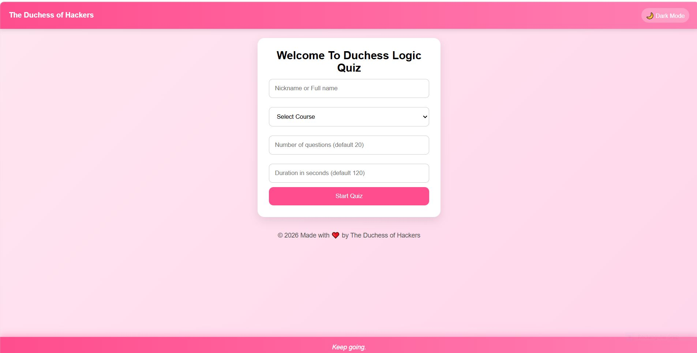

# Duchess Logic Quiz

An interactive, gamified quiz web application built with **HTML, CSS, and JavaScript**.
Designed to make learning programming concepts engaging through real-time feedback, scoring systems, and user-focused UI/UX.

---

##  Live Demo

👉 https://yourusername.github.io/duchess-quiz/

---

##  Key Features

-  **Timer-Based Quiz System** – Adds urgency and focus
-  **Dynamic Scoring & Grading System (A+ – F)**
-  **Streak Tracking** – Rewards consecutive correct answers
-  **Dark Mode Toggle** – Improved accessibility and user preference
-  **Motivational Quote Engine** – Auto-updating, non-repetitive quotes
-  **Progress Tracking** – Real-time quiz progression
-  **Confetti Celebration** – Visual feedback on completion
-  **Leaderboard (LocalStorage)** – Stores top 10 scores
-  **Randomized Questions** – Enhances replayability

---

##  How It Works

1. Enter your name
2. Select a category (**Python** or **General Coding**)
3. Choose number of questions and duration
4. Answer multiple-choice questions
5. Receive score, grade, and feedback
6. Retry to improve performance

---

## Tech Stack

- **HTML5** – Structure
- **CSS3** – Styling (Flexbox, Gradients, Animations)
- **JavaScript (ES6)** – Application logic & DOM manipulation
- **LocalStorage API** – Persistent leaderboard
- **Canvas Confetti** – Visual effects

---

##  Project Structure

```

duchess-quiz/
│
├── index.html
├── style.css
├── script.js
│
├── /assets
│   ├── sounds/
│   │   ├── correct.mp3
│   │   ├── wrong.mp3
│   │   └── finish.mp3
│   └── images/
│
└── README.md

```

---

##  System Highlights

###  Gamification Engine
- Tracks streaks to encourage consistency
- Grading system reinforces performance awareness

###  Motivation Engine
- Dynamically rotates quotes
- Avoids repetition for better user experience

###  Leaderboard System
- Stores top 10 scores locally
- Ranks users based on performance percentage

###  UI/UX Design
- Modern gradient interface
- Glassmorphism-inspired card layout
- Responsive across devices

---

##  Future Enhancements

-  Online leaderboard (database integration)
-  User authentication system
-  Admin analytics dashboard
-  Difficulty levels (Easy / Medium / Hard)
-  Mobile app version (React Native / Flutter)

---

##  Author

Built with intention and creativity by **The Duchess of Hackers**

> *“Learning to code isn’t about speed — it’s about consistency.”*

---

##  Preview


---

##  License

This project is open-source and intended for educational and portfolio use.


